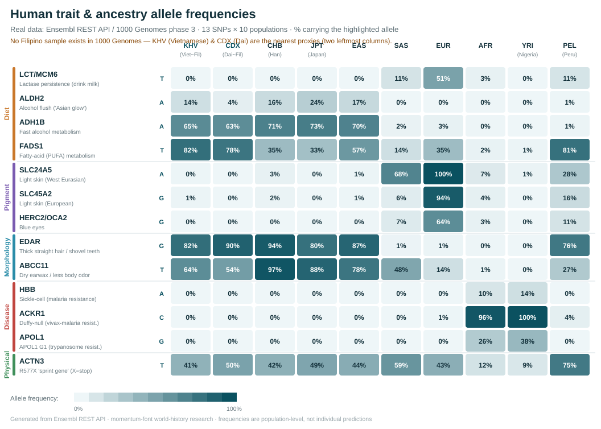
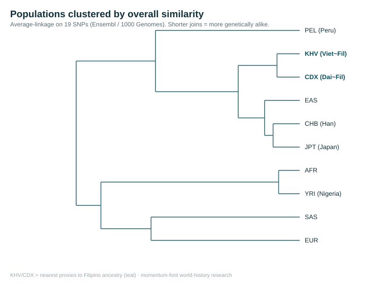

# Allele-Frequency Analysis: Trait & Ancestry SNPs

*A hands-on analysis using **real downloaded data** — not textbook numbers.
Population allele frequencies were pulled live from the **Ensembl REST API**
(1000 Genomes Project, phase 3) for a panel of trait/ancestry genes spanning
diet, pigmentation, morphology, sensory, physical, pharmacogenomic, health,
and disease-resistance loci — then tabulated, visualized, and clustered.*

Run 3 August 2026 · **19 SNPs × 10 populations** · reproducible via the
scripts in this folder.



---

## What was done

1. `fetch_freqs.py` — queries `rest.ensembl.org/variation/human/<rsID>?pops=1`
   for 19 SNPs; extracts 1000 Genomes phase-3 frequencies of the
   trait-relevant allele for 10 populations (strand-corrected; *absent* 0%
   distinguished from *not-genotyped* n/a). → `allele_frequencies.csv`,
   `raw_variation.json`.
2. `make_svg.py` — renders the categorized heatmap above.
3. `cluster.py` — computes a population distance matrix and an
   average-linkage dendrogram (pure Python). →
   `population_distance_matrix.csv`, `population_dendrogram.svg`.

**Limitation up front:** 1000 Genomes has **no Filipino sample.** Nearest
proxies are **KHV (Kinh Vietnamese)** and **CDX (Dai)** — Southeast Asian,
Austronesian-adjacent, but not Filipino. Directional only.

## The data (highlight-allele %, 1000 Genomes phase 3)

| Cat | Gene | Al | Trait | KHV | CDX | CHB | JPT | EAS | SAS | EUR | AFR | YRI | PEL |
|---|---|---|---|--:|--:|--:|--:|--:|--:|--:|--:|--:|--:|
| Diet | LCT/MCM6 | T | Lactase persistence | 0 | 0 | 0 | 0 | 0 | 11 | **51** | 3 | 0 | 11 |
| Diet | ALDH2 | A | Alcohol flush | 14 | 4 | 16 | 24 | 17 | 0 | 0 | 0 | 0 | 1 |
| Diet | ADH1B | A | Fast alcohol metabolism | 65 | 63 | 71 | 73 | 70 | 2 | 3 | 0 | 0 | 1 |
| Diet | FADS1 | T | Fatty-acid metabolism | 82 | 78 | 35 | 33 | 57 | 14 | 35 | 2 | 1 | 81 |
| Pigment | SLC24A5 | A | Light skin (W-Eurasian) | 1 | 0 | 3 | 1 | 1 | 69 | **100** | 7 | 1 | 28 |
| Pigment | SLC45A2 | G | Light skin (European) | 1 | 0 | 2 | 0 | 1 | 6 | **94** | 4 | 0 | 16 |
| Pigment | HERC2 | G | Blue eyes | 0 | 0 | 0 | 0 | 0 | 7 | **64** | 3 | 0 | 11 |
| Pigment | OCA2 | C | Light skin (**E-Asian route**) | 59 | 62 | 59 | 57 | 60 | 0 | 0 | 0 | 0 | 0 |
| Morphology | EDAR | G | Thick hair / shovel teeth | 82 | 90 | 94 | 80 | 87 | 1 | 1 | 0 | 0 | 76 |
| Morphology | ABCC11 | T | Dry earwax / less odor | 64 | 54 | 97 | 88 | 78 | 48 | 14 | 1 | 0 | 27 |
| Sensory | TAS2R38 | G | Bitter-taste (PTC) | 75 | 72 | 68 | 57 | 68 | 35 | 42 | 48 | 46 | 86 |
| Physical | ACTN3 | T | R577X "sprint gene" (X=stop) | 41 | 51 | 42 | 49 | 44 | 59 | 43 | 12 | 9 | 75 |
| Pharma | CYP2C19 | A | *2 poor metabolizer | 28 | 26 | 34 | 32 | 31 | 36 | 15 | 17 | 17 | 6 |
| Health | APOE | C | e4 (Alzheimer risk) | 9 | 10 | 10 | 8 | 9 | 9 | 16 | **27** | 24 | 6 |
| Disease | HBB | A | Sickle-cell (malaria) | 0 | 0 | 0 | 0 | 0 | 0 | 0 | 10 | 14 | 0 |
| Disease | ACKR1 | C | Duffy-null (vivax malaria) | 0 | 0 | 0 | 0 | 0 | 0 | 1 | **96** | **100** | 4 |
| Disease | APOL1 | G | G1 (trypanosome) | 0 | 0 | 0 | 0 | 0 | 0 | 0 | 26 | 38 | 0 |
| Disease | FUT2 | A | Non-secretor (gut immunity) | 1 | 0 | 2 | 0 | 0 | 28 | 44 | 49 | 54 | 12 |
| Disease | G6PD | T | A- deficiency (malaria) | 0 | 0 | 0 | 0 | 0 | 0 | 0 | 14 | 21 | 0 |

(Full-precision values in `allele_frequencies.csv`.)

## Key findings

**1. Convergent evolution, proven in the data — light skin is not one gene.**
Europeans light-skinned via **SLC24A5 (100%) + SLC45A2 (94%)**; East Asians
(also light-skinned) carry those at **~1%** but have their **own** light-skin
allele in **OCA2 (~60%)**, absent everywhere else. Two peoples, same trait,
**different genes**. The single clearest refutation of "race = one genetic
thing."

**2. Your lactose intolerance = 0.0%** persistence across all East Asian
groups (vs 51% EUR). Confirmed.

**3. Pharmacogenomics ties back to the meds thread.** The **CYP2C19\*2**
poor-metabolizer allele (affects clopidogrel/Plavix, some antidepressants) is
**~28–34% in East Asians incl. the Filipino proxies**, roughly **double** the
European 15%. Real, ancestry-linked drug-response difference.

**4. The Austronesian cluster** (EDAR, ADH1B, ABCC11, OCA2) is strong in your
proxies; **FADS1** groups them with Peru, not Northeast Asia.

**5. Malaria/disease genes are sharply African** — Duffy-null 96–100%,
sickle-cell 10–14%, APOL1 26–38%, G6PD-A- 14–21% — all ~0% elsewhere. Local
pathogen adaptations, not whole-person differences.

**6. Honesty check holds** — ACTN3 stays the flattest, least-distinctive row.

## Populations clustered by similarity



Merge order (closest pairs first):

```
AFR + YRI                       d=0.18   (tightest pair)
KHV + CDX                       d=0.19   (Filipino proxies pair up first)
CHB + JPT                       d=0.23
  -> East Asian core
KHV/CDX joins East Asian core   d=0.53
PEL (Peru) joins East Asians    d=1.23   (Native American <- East Asian ancestry)
SAS + EUR                       d=1.27   (West Eurasian group)
```

**What it shows:** the Filipino proxies pair first with each other, then nest
inside the East Asian clade; **Peru attaches to the East Asian branch**
(reflecting the Beringian migration); and **South Asians group with
Europeans** (West Eurasian). The relationships track real ancestry.

**Crucial caveat — what it does NOT show.** This is **19 hand-picked *trait*
SNPs**, not genome-wide neutral markers. So the tree measures *"who resembles
whom in these adaptive traits,"* **not** the true out-of-Africa family tree.
Tell-tale sign: a real genome-wide tree makes **Africans the deep outgroup**
(everyone else nested inside African diversity); here they don't sit at the
root, precisely because selected/ascertained loci distort deep structure. Use
this dendrogram for *trait affinity*, and genome-wide data (SGDP/HGDP) for
true phylogeny.

## Caveats

- **Proxies, not Filipinos**; misses the deep Negrito/Denisovan layer (needs
  controlled-access Ayta genomes).
- **No highland/Oceanian samples** in 1000G → Tibetan-EPAS1 and
  Ayta/Papuan-Denisovan signals can't be shown (flagged, not faked).
- **Ascertainment bias**: several markers (European lactase; African G6PD-A-)
  are population-discovered and undercount the *same trait* reached by other
  mutations elsewhere (e.g. Filipino G6PD deficiency uses Mahidol/Viangchan
  variants, not the African A- allele shown here).
- **Allele frequency ≠ phenotype**; polygenic; not medical advice.

## Reproduce it

```bash
cd analysis
python3 fetch_freqs.py   # download -> CSV + raw JSON
python3 make_svg.py      # heatmap
python3 cluster.py       # distance matrix + dendrogram
```
No API key required; Ensembl REST is open.
