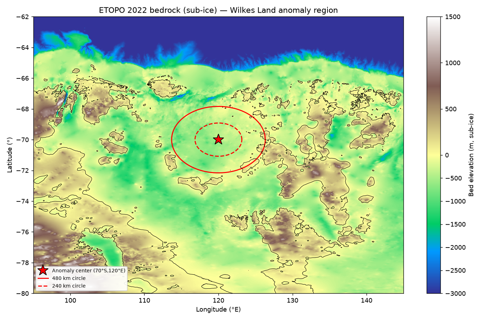

# Testing the Wilkes Land anomaly hypotheses against the bedrock

**Question:** the Wilkes Land gravity anomaly (~70°S, 120°E) is claimed by some to be
Earth's largest impact crater (~480 km). Does the **sub-ice bedrock shape** support that?

**Data:** NOAA **ETOPO 2022 bedrock** (60 arc-sec), which incorporates **BedMachine
Antarctica** under the ice. Pulled via OPeNDAP and subset to the Wilkes Land window.
Reproduce: `python3 analyze_bed.py`.

## What the bedrock shows
Radial profile from the anomaly centre (grounded bed):

| ring (km) | mean bed (m) |
|---|---:|
| 0–60 | −511 |
| 60–120 | −517 |
| 120–180 | −462 |
| 180–240 | −371 |
| 240–300 | −262 |

- **No raised circular rim** — the centre sits in a broad lowland bordered by *irregular*
  highland blocks that extend well beyond the ~480 km circle (regional terrain, not a rim).
- **No central peak** — the middle is flat (0–60 km = −511 m vs 60–120 km = −517 m). A large
  complex crater should have a central structural uplift; there isn't one.
- **A shallow, outward-rising saucer**, merging into the broader **Aurora / Wilkes Subglacial
  Basin** — consistent with a **tectonic/erosional basin** (Australia–Antarctica rifting).

## Verdict
The bedrock morphology favours the **subglacial tectonic-basin** explanation over the impact
hypothesis — none of the classic impact signatures are present.

**Caveats (this is not a refutation):**
1. Interior East Antarctic bed is sparsely surveyed and heavily interpolated — a real
   rim/peak could be smoothed out.
2. A ~250-Myr structure would be erased at the surface by erosion + isostatic relaxation;
   the impact claim rests on the *deep* mantle-plug gravity signal, which topography can't see.
3. ~2 km resolution resolves the gross basin shape but not subtle central-uplift detail.
